 ## line plot


```python
import seaborn as sns
import matplotlib.pyplot as plt
```


```python
fmri=sns.load_dataset("fmri")
```


```python
fmri.head()
```


<div>
<style scoped>
    .dataframe tbody tr th:only-of-type {
        vertical-align: middle;
    }

    .dataframe tbody tr th {
        vertical-align: top;
    }

    .dataframe thead th {
        text-align: right;
    }
</style>
<table border="1" class="dataframe">
  <thead>
    <tr style="text-align: right;">
      <th></th>
      <th>subject</th>
      <th>timepoint</th>
      <th>event</th>
      <th>region</th>
      <th>signal</th>
    </tr>
  </thead>
  <tbody>
    <tr>
      <th>0</th>
      <td>s13</td>
      <td>18</td>
      <td>stim</td>
      <td>parietal</td>
      <td>-0.017552</td>
    </tr>
    <tr>
      <th>1</th>
      <td>s5</td>
      <td>14</td>
      <td>stim</td>
      <td>parietal</td>
      <td>-0.080883</td>
    </tr>
    <tr>
      <th>2</th>
      <td>s12</td>
      <td>18</td>
      <td>stim</td>
      <td>parietal</td>
      <td>-0.081033</td>
    </tr>
    <tr>
      <th>3</th>
      <td>s11</td>
      <td>18</td>
      <td>stim</td>
      <td>parietal</td>
      <td>-0.046134</td>
    </tr>
    <tr>
      <th>4</th>
      <td>s10</td>
      <td>18</td>
      <td>stim</td>
      <td>parietal</td>
      <td>-0.037970</td>
    </tr>
  </tbody>
</table>
</div>


line plot with time and signal column data


```python
sns.lineplot(x="timepoint",y="signal",data=fmri)
plt.show()
```


    
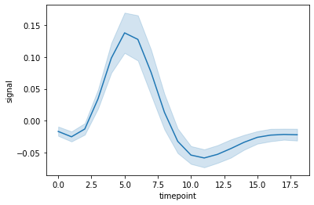
    


```python
sns.lineplot(x="timepoint",y="signal",data=fmri,hue="event")
plt.show()
```


    
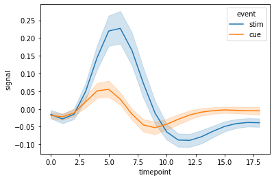
    


adding markers for value point


```python
sns.lineplot(x="timepoint",y="signal",data=fmri,hue="event",style="event",markers=True)
plt.show()
```


    
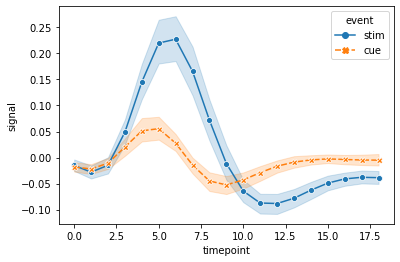
    


 ## barplot


```python
import pandas as pd
pokemon=pd.read_csv('pokemon.csv')
```


```python
pokemon.head()
```


<div>
<style scoped>
    .dataframe tbody tr th:only-of-type {
        vertical-align: middle;
    }

    .dataframe tbody tr th {
        vertical-align: top;
    }

    .dataframe thead th {
        text-align: right;
    }
</style>
<table border="1" class="dataframe">
  <thead>
    <tr style="text-align: right;">
      <th></th>
      <th>abilities</th>
      <th>against_bug</th>
      <th>against_dark</th>
      <th>against_dragon</th>
      <th>against_electric</th>
      <th>against_fairy</th>
      <th>against_fight</th>
      <th>against_fire</th>
      <th>against_flying</th>
      <th>against_ghost</th>
      <th>...</th>
      <th>percentage_male</th>
      <th>pokedex_number</th>
      <th>sp_attack</th>
      <th>sp_defense</th>
      <th>speed</th>
      <th>type1</th>
      <th>type2</th>
      <th>weight_kg</th>
      <th>generation</th>
      <th>is_legendary</th>
    </tr>
  </thead>
  <tbody>
    <tr>
      <th>0</th>
      <td>['Overgrow', 'Chlorophyll']</td>
      <td>1.0</td>
      <td>1.0</td>
      <td>1.0</td>
      <td>0.5</td>
      <td>0.5</td>
      <td>0.5</td>
      <td>2.0</td>
      <td>2.0</td>
      <td>1.0</td>
      <td>...</td>
      <td>88.1</td>
      <td>1</td>
      <td>65</td>
      <td>65</td>
      <td>45</td>
      <td>grass</td>
      <td>poison</td>
      <td>6.9</td>
      <td>1</td>
      <td>0</td>
    </tr>
    <tr>
      <th>1</th>
      <td>['Overgrow', 'Chlorophyll']</td>
      <td>1.0</td>
      <td>1.0</td>
      <td>1.0</td>
      <td>0.5</td>
      <td>0.5</td>
      <td>0.5</td>
      <td>2.0</td>
      <td>2.0</td>
      <td>1.0</td>
      <td>...</td>
      <td>88.1</td>
      <td>2</td>
      <td>80</td>
      <td>80</td>
      <td>60</td>
      <td>grass</td>
      <td>poison</td>
      <td>13.0</td>
      <td>1</td>
      <td>0</td>
    </tr>
    <tr>
      <th>2</th>
      <td>['Overgrow', 'Chlorophyll']</td>
      <td>1.0</td>
      <td>1.0</td>
      <td>1.0</td>
      <td>0.5</td>
      <td>0.5</td>
      <td>0.5</td>
      <td>2.0</td>
      <td>2.0</td>
      <td>1.0</td>
      <td>...</td>
      <td>88.1</td>
      <td>3</td>
      <td>122</td>
      <td>120</td>
      <td>80</td>
      <td>grass</td>
      <td>poison</td>
      <td>100.0</td>
      <td>1</td>
      <td>0</td>
    </tr>
    <tr>
      <th>3</th>
      <td>['Blaze', 'Solar Power']</td>
      <td>0.5</td>
      <td>1.0</td>
      <td>1.0</td>
      <td>1.0</td>
      <td>0.5</td>
      <td>1.0</td>
      <td>0.5</td>
      <td>1.0</td>
      <td>1.0</td>
      <td>...</td>
      <td>88.1</td>
      <td>4</td>
      <td>60</td>
      <td>50</td>
      <td>65</td>
      <td>fire</td>
      <td>NaN</td>
      <td>8.5</td>
      <td>1</td>
      <td>0</td>
    </tr>
    <tr>
      <th>4</th>
      <td>['Blaze', 'Solar Power']</td>
      <td>0.5</td>
      <td>1.0</td>
      <td>1.0</td>
      <td>1.0</td>
      <td>0.5</td>
      <td>1.0</td>
      <td>0.5</td>
      <td>1.0</td>
      <td>1.0</td>
      <td>...</td>
      <td>88.1</td>
      <td>5</td>
      <td>80</td>
      <td>65</td>
      <td>80</td>
      <td>fire</td>
      <td>NaN</td>
      <td>19.0</td>
      <td>1</td>
      <td>0</td>
    </tr>
  </tbody>
</table>
<p>5 rows × 41 columns</p>
</div>


checking speed of legendary pokemon


```python
sns.barplot(x="is_legendary",y="speed",data=pokemon)
plt.show()
```


    
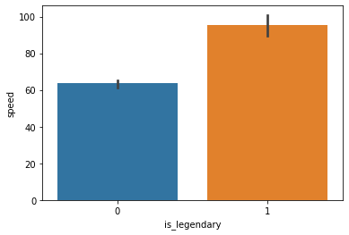
    


checking weight of legendary pokemon


```python
sns.barplot(x="is_legendary",y="weight_kg",data=pokemon)
plt.show()
```


    
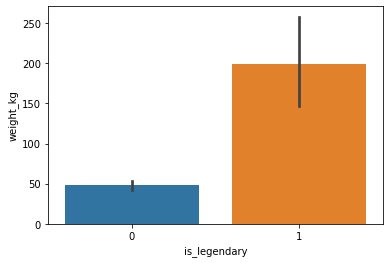
    


adding a hue to show pokemon generation


```python
sns.barplot(x="is_legendary",y="speed",hue="generation",data=pokemon)
plt.show()
```


    
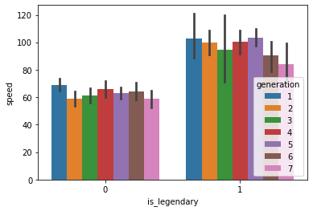
    


using palettes to assign different color elements


```python
sns.barplot(x="is_legendary",y="speed",palette="vlag",data=pokemon)
plt.show()
```


    
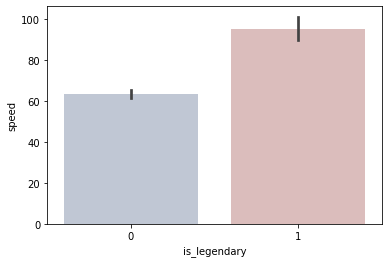
    


 ## scatter plot


```python
iris=pd.read_csv("IRIS.csv")
```


```python
iris.head()
```


<div>
<style scoped>
    .dataframe tbody tr th:only-of-type {
        vertical-align: middle;
    }

    .dataframe tbody tr th {
        vertical-align: top;
    }

    .dataframe thead th {
        text-align: right;
    }
</style>
<table border="1" class="dataframe">
  <thead>
    <tr style="text-align: right;">
      <th></th>
      <th>sepal_length</th>
      <th>sepal_width</th>
      <th>petal_length</th>
      <th>petal_width</th>
      <th>species</th>
    </tr>
  </thead>
  <tbody>
    <tr>
      <th>0</th>
      <td>5.1</td>
      <td>3.5</td>
      <td>1.4</td>
      <td>0.2</td>
      <td>Iris-setosa</td>
    </tr>
    <tr>
      <th>1</th>
      <td>4.9</td>
      <td>3.0</td>
      <td>1.4</td>
      <td>0.2</td>
      <td>Iris-setosa</td>
    </tr>
    <tr>
      <th>2</th>
      <td>4.7</td>
      <td>3.2</td>
      <td>1.3</td>
      <td>0.2</td>
      <td>Iris-setosa</td>
    </tr>
    <tr>
      <th>3</th>
      <td>4.6</td>
      <td>3.1</td>
      <td>1.5</td>
      <td>0.2</td>
      <td>Iris-setosa</td>
    </tr>
    <tr>
      <th>4</th>
      <td>5.0</td>
      <td>3.6</td>
      <td>1.4</td>
      <td>0.2</td>
      <td>Iris-setosa</td>
    </tr>
  </tbody>
</table>
</div>


```python
sns.scatterplot(x="sepal_length",y="petal_length",data=iris)
plt.show()
```


    
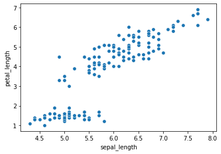
    


```python
sns.scatterplot(x="sepal_length",y="petal_length",data=iris,hue="species")
plt.show()
```


    
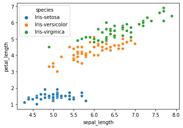
    


adding heu on petal length to differentiate


```python
sns.scatterplot(x="sepal_length",y="petal_length",data=iris,hue="petal_length")
plt.show()
```


    
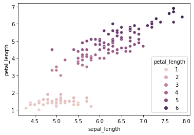
    


 ## histogram/dist plot


```python
diamonds=pd.read_csv('diamonds.csv')
```


```python
diamonds.head()
```


<div>
<style scoped>
    .dataframe tbody tr th:only-of-type {
        vertical-align: middle;
    }

    .dataframe tbody tr th {
        vertical-align: top;
    }

    .dataframe thead th {
        text-align: right;
    }
</style>
<table border="1" class="dataframe">
  <thead>
    <tr style="text-align: right;">
      <th></th>
      <th>Unnamed: 0</th>
      <th>carat</th>
      <th>cut</th>
      <th>color</th>
      <th>clarity</th>
      <th>depth</th>
      <th>table</th>
      <th>price</th>
      <th>x</th>
      <th>y</th>
      <th>z</th>
    </tr>
  </thead>
  <tbody>
    <tr>
      <th>0</th>
      <td>1</td>
      <td>0.23</td>
      <td>Ideal</td>
      <td>E</td>
      <td>SI2</td>
      <td>61.5</td>
      <td>55.0</td>
      <td>326</td>
      <td>3.95</td>
      <td>3.98</td>
      <td>2.43</td>
    </tr>
    <tr>
      <th>1</th>
      <td>2</td>
      <td>0.21</td>
      <td>Premium</td>
      <td>E</td>
      <td>SI1</td>
      <td>59.8</td>
      <td>61.0</td>
      <td>326</td>
      <td>3.89</td>
      <td>3.84</td>
      <td>2.31</td>
    </tr>
    <tr>
      <th>2</th>
      <td>3</td>
      <td>0.23</td>
      <td>Good</td>
      <td>E</td>
      <td>VS1</td>
      <td>56.9</td>
      <td>65.0</td>
      <td>327</td>
      <td>4.05</td>
      <td>4.07</td>
      <td>2.31</td>
    </tr>
    <tr>
      <th>3</th>
      <td>4</td>
      <td>0.29</td>
      <td>Premium</td>
      <td>I</td>
      <td>VS2</td>
      <td>62.4</td>
      <td>58.0</td>
      <td>334</td>
      <td>4.20</td>
      <td>4.23</td>
      <td>2.63</td>
    </tr>
    <tr>
      <th>4</th>
      <td>5</td>
      <td>0.31</td>
      <td>Good</td>
      <td>J</td>
      <td>SI2</td>
      <td>63.3</td>
      <td>58.0</td>
      <td>335</td>
      <td>4.34</td>
      <td>4.35</td>
      <td>2.75</td>
    </tr>
  </tbody>
</table>
</div>


```python
sns.distplot(diamonds['price'])
plt.show()
```

    C:\Users\VIMALA\Anaconda3\lib\site-packages\seaborn\distributions.py:2619: FutureWarning: `distplot` is a deprecated function and will be removed in a future version. Please adapt your code to use either `displot` (a figure-level function with similar flexibility) or `histplot` (an axes-level function for histograms).
      warnings.warn(msg, FutureWarning)
    


    
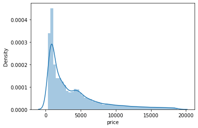
    


printing only frequency curve


```python
sns.distplot(diamonds['price'],hist=False)
plt.show()
```

    C:\Users\VIMALA\Anaconda3\lib\site-packages\seaborn\distributions.py:2619: FutureWarning: `distplot` is a deprecated function and will be removed in a future version. Please adapt your code to use either `displot` (a figure-level function with similar flexibility) or `kdeplot` (an axes-level function for kernel density plots).
      warnings.warn(msg, FutureWarning)
    


    
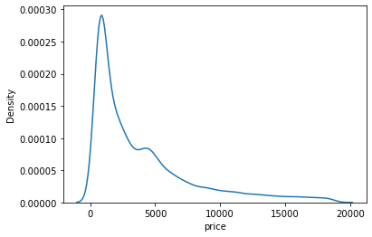
    


```python
sns.distplot(diamonds['price'],bins=5)
plt.show()
```

    C:\Users\VIMALA\Anaconda3\lib\site-packages\seaborn\distributions.py:2619: FutureWarning: `distplot` is a deprecated function and will be removed in a future version. Please adapt your code to use either `displot` (a figure-level function with similar flexibility) or `histplot` (an axes-level function for histograms).
      warnings.warn(msg, FutureWarning)
    


    
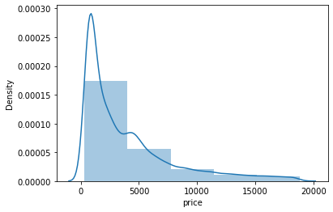
    


on vertical axis


```python
sns.distplot(diamonds['price'],bins=5,vertical=True)
plt.show()
```

    C:\Users\VIMALA\Anaconda3\lib\site-packages\seaborn\distributions.py:2619: FutureWarning: `distplot` is a deprecated function and will be removed in a future version. Please adapt your code to use either `displot` (a figure-level function with similar flexibility) or `histplot` (an axes-level function for histograms).
      warnings.warn(msg, FutureWarning)
    C:\Users\VIMALA\Anaconda3\lib\site-packages\seaborn\distributions.py:1689: FutureWarning: The `vertical` parameter is deprecated and will be removed in a future version. Assign the data to the `y` variable instead.
      warnings.warn(msg, FutureWarning)
    


    
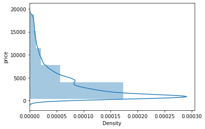
    


```python

```
